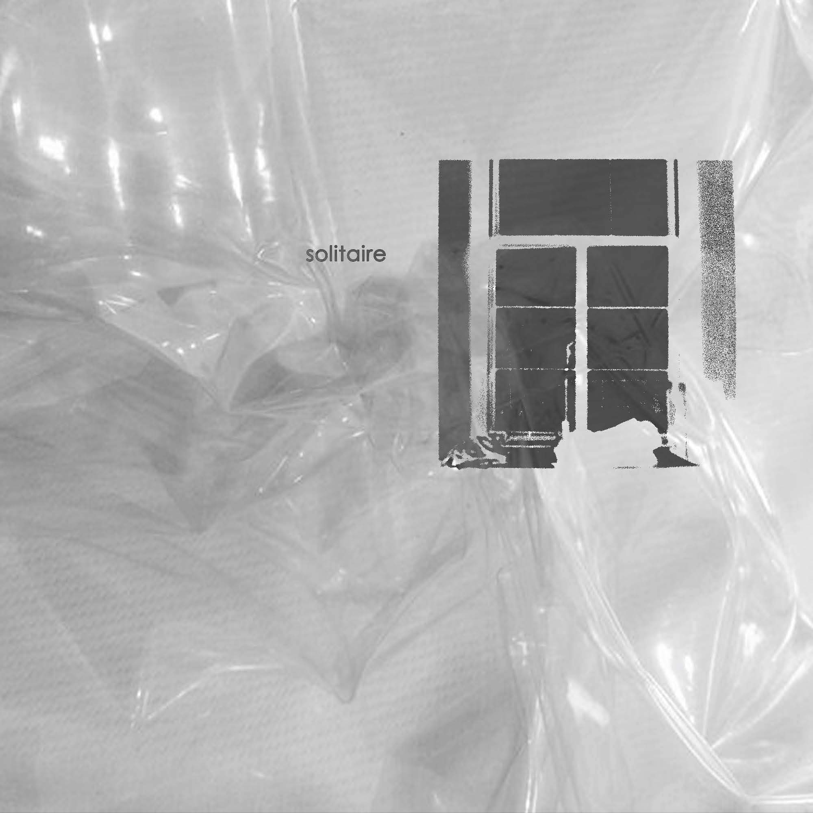

<!-- Gothic README for Art Website -->

<p align="center">
  
</p>

<p align="center">
  
</p>

<h1 align="center"><span style="color:#8B5CF6;">☠️ enWRETCHED ART WEBSITE ☠️</span></h1>

---

## 🎯 Professional Summary

**Digital Artist & Full-Stack Developer** im a student in web development, creating web tools, visual experiences with the expertice of software that i've aquired. I combine technical proficiency with creative vision to build performant, user-centric applications. Specializes in:

- **Frontend Development**: Modern React applications with TypeScript
- **Performance Optimization**: Core Web Vitals, SEO, and user experience
- **Creative Design**: Digital art, graphic design, and multimedia content
- **Full-Stack Solutions**: End-to-end application development

**Currently seeking opportunities** in frontend development, UI/UX design, or creative technology roles where I can leverage both technical and artistic skills.

---

## 🦇 Features

- 🕸️ **My Gallery**: Surreal, digital, and mixed media art
- 🦴 **Personal Blog**: A digital diary for me to get my thoughts out there about current things im working on, or where im at in life at the momemt.
- 🦾 **Performance Optimizer**: Because even evil needs to be fast
- 🦉 **SEO Sorcery**: Summon Google's attention

---

## 🩸 Tech Stack & Software Proficiency

### 🖥️ **Frontend Development**
```txt
Next.js 14 • React 18 • TypeScript • TailwindCSS • JavaScript (ES6+) • HTML5 • CSS3
```

### 🎨 **Design & Creative Software**
```txt
Adobe Creative Suite • Photoshop • Illustrator • InDesign • Lightroom • Premiere Pro
Figma • Canva • Procreate • Blender • DaVinci Resolve
```

### 🗄️ **Backend & Database**
```txt
Node.js • MongoDB • Mongoose • AdobeSuite • RESTful APIs • GraphQL • TypeScript <3 • Vercel 
```

### 🚀 **Performance & Optimization**
```txt
Core Web Vitals • Lighthouse • Service Workers • Image Optimization • Bundle Splitting
WebP/AVIF Formats • Lazy Loading • CDN Integration • Caching Strategies
```

### 🛠️ **Development Tools**
```txt
Git • GitHub • VS Code • Postman • Chrome DevTools • npm/yarn
ESLint • Prettier • Husky • Jest • Cypress
```

### ☁️ **Deployment & Hosting**
```txt
Vercel • Netlify • AWS • Docker • CI/CD Pipelines • GitHub Actions
```

### 📱 **Mobile & Responsive**
```txt
Progressive Web Apps (PWA) • Mobile-First Design • Responsive Frameworks
iOS/Android Development • React Native (Learning)
```

### 🔒 **Security & Best Practices**
```txt
OAuth • JWT • HTTPS • Content Security Policy • XSS Prevention
Input Validation • Rate Limiting • Security Headers
```

---

## 🧛‍♂️ Technical Skills Breakdown

### **Web Development**
- ✅ **Full-Stack Development**: End-to-end application development
- ✅ **Modern JavaScript**: ES6+, async/await, modules, destructuring
- ✅ **React Ecosystem**: Hooks, Context, Redux, React Router
- ✅ **TypeScript**: Type safety, interfaces, generics, utility types
- ✅ **CSS Frameworks**: TailwindCSS, Bootstrap, custom CSS animations
- ✅ **Performance Optimization**: Core Web Vitals, bundle optimization

### **Design & Creative**
- ✅ **UI/UX Design**: User-centered design principles, wireframing, prototyping
- ✅ **Graphic Design**: Logo design, branding, print materials
- ✅ **Digital Art**: Digital painting, photo manipulation, illustration
- ✅ **Video Editing**: Motion graphics, color grading, video effects
- ✅ **3D Modeling**: Basic 3D modeling and texturing

### **Database & Backend**
- ✅ **NoSQL Databases**: MongoDB with Mongoose ODM
- ✅ **SQL Databases**: PostgreSQL, MySQL (familiar)
- ✅ **API Development**: RESTful APIs, GraphQL (learning)
- ✅ **Authentication**: JWT, OAuth, session management
- ✅ **Data Modeling**: Schema design, relationships, indexing

### **DevOps & Tools**
- ✅ **Version Control**: Git workflows, branching strategies, collaboration
- ✅ **CI/CD**: Automated testing, deployment pipelines
- ✅ **Cloud Services**: Vercel, Netlify, AWS basics
- ✅ **Testing**: Unit testing, integration testing, E2E testing
- ✅ **Monitoring**: Performance monitoring, error tracking

---

## 🕯️ Getting Started

```bash
git clone https://github.com/h4nds/Enwretched-Blog.git
cd art-website
npm install
npm run dev
```

---

## 🧛‍♂️ Gallery Preview

<p align="center">
  
  
  
</p>

---

## 🕷️ Contact & Professional Links

- 🦇 [Portfolio](https://enwretched.com)
- 🕸️ [Email](wretchray@gmail.com)
- 🦉 [LinkedIn](https://www.linkedin.com/in/ray-wretch-24b5432a7/)
- 🎨 [Behance](https://www.behance.net/raywretch)
- 📷 [Instagram](https://instagram.com/raywretch)

---

<p align="center">
  
</p>

---

<details>
  <summary>🩸 <b>Click for a curse</b></summary>
  
  ```
  You have been cursed with infinite creativity.
  May your code always compile, and the art thrive.
  ```
</details>
